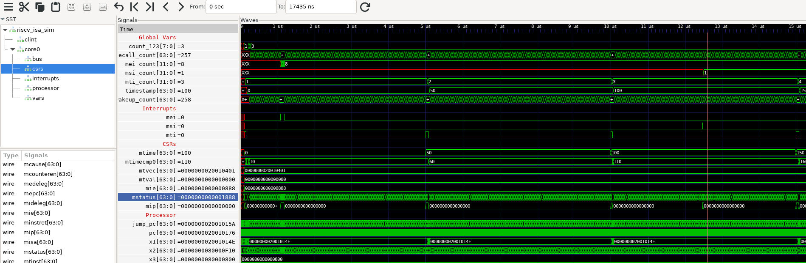

Example for VCD Tracing
=======================

A small program that handles mie, msi, mti and trap interrupts and updates some global variables on interrupts.

Details
-------

The `main.c` program sets up a vectored interrupt handler and a 1Mhz
machine timer interrupt. Each time the core wakes from `wfi` it calls
`ecall` to trigger the exception handler. Various global variables are
updated inside of the interrupt handlers so the status can be
observed.

~~~
// Global to hold current timestamp, written in MTI handler.
static volatile uint64_t timestamp = 0;

// Some variables that can be traced and be of interest
static volatile uint8_t count_123 = 0;
static volatile uint64_t wakeup_count = 0;
static volatile uint64_t ecall_count = 0;

// Count each interrupt
static volatile uint32_t mti_count = 0;
static volatile uint32_t msi_count = 0;
static volatile uint32_t mei_count = 0;
~~~

The `run_sim.cmd` sets up a trace for the global variables and asserts the `mei` and `msi` interrupts.

Requirements
------------

- A RISC-V GCC Cross Compiler: https://github.com/xpack-dev-tools/riscv-none-elf-gcc-xpack/releases/tag/v12.1.0-2/
- A forked riscv-isa-sim to run the simulation: https://github.com/five-embeddev/riscv-isa-sim/tree/vcd_trace
- GTKWave to view the results: https://github.com/gtkwave/gtkwave

Running a Simulation
--------------------

Update `run_sim.sh` and set `SPIKE=../../riscv-isa-sim/spike` to the path of the RISC-V ISA Simulator.

~~~
make
source ./run_sim.sh
vcd2fst vcd-trace.vcd vcd-trace.fst
gtkwave vcd-trace.fst vcd-trace.gtkw
~~~

Output
------

The trace below shows:

- Global variables update over time, particularly after interrupts.
- Interrupt strobes.
- CSR changes to setup and process interrupts.
- Processor registers (pc, ra, gp, sp)

